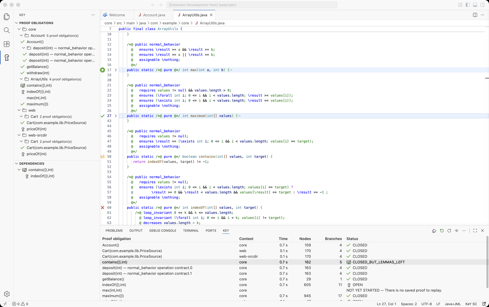
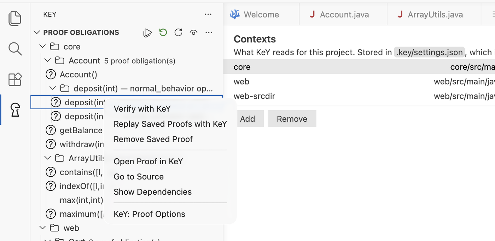
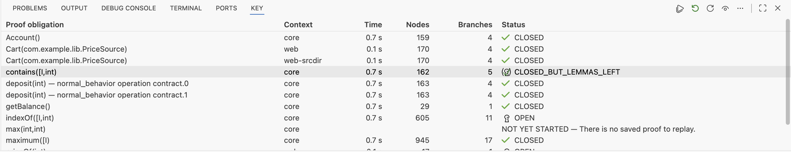
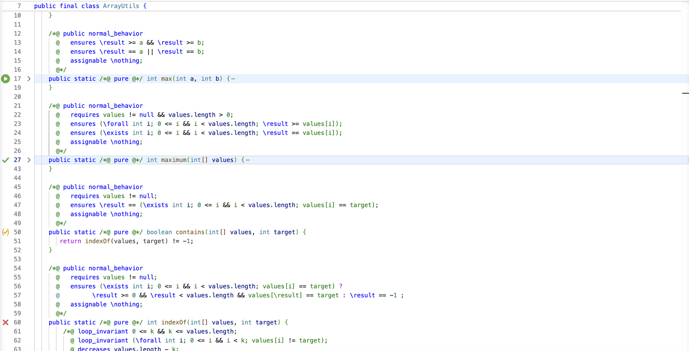

# The interface

Everything the extension adds, and what it means.

## Where the views are

The KeY icon in the activity bar opens two panes, **Proof Obligations** and
**Dependencies**. **Verification** is a table, so it sits in the bottom panel beside the
terminal, where it has the width a table wants.

Every KeY pane carries the same toolbar, so an action is in the same place whichever pane is
in front.

### Proof Obligations

Everything the project can be asked to prove, by context, then class, then method. A method
with several specification cases gets a row per case underneath it. Selecting a row opens
the source it belongs to.

The row's buttons and its context menu act on that row, and on every row selected with it:

| Action | What it does |
|---|---|
| **Verify Proof Obligations** | prove them, without opening KeY |
| **Replay Saved Proofs** | read the saved proofs back and report what they are |
| **Remove Saved Proof** | delete the proof files, after asking |
| **Open Proof in KeY** | open the proof in a KeY window of its own, to look at it |
| **Go to Source** | open the class at the declaration the contract belongs to |
| **Show Dependencies** | fill the Dependencies pane with what this proof rests on |
| **KeY: Proof Options** | the taclet and strategy options this selection is proved with |

The toolbar carries **Verify Everything**, **Replay Every Saved Proof**, **Verify on Save**
and **Refresh**, and a menu with the project's proof options, the prover, the contexts, the
trash and **Restart KeY**.

**Verify on Save** is an eye: open when it is on, closed when it is off, so its state is
visible without opening a menu.

### Verification

A table of where each proof obligation stands, with a column for each thing worth comparing:

| Column | What it says |
|---|---|
| Proof obligation | the method the contract is about, with the kind of contract added where a method has several |
| Time | how long the attempt took, blank where nothing has been measured |
| Nodes, Branches | how large the proof is |
| Status | the state, KeY's own icon before it, and what went wrong after it |

Click a heading to sort by it; rows with no measurement sort last either way. Click a row to
select it, ⌘-click or shift-click for several, double-click to open the source, and
right-click for the editor's own menu at the pointer, with the same actions the other views
offer.

Where a saved proof was made under settings that differ from the ones configured now, the
status cell carries a **settings differ** link. It lists what differs and offers the two
things worth doing: open the proof that was made, or prove it again under the settings that
hold today.

The pane lists the whole project the first time it is shown, so it says how much is done
rather than only what this session has run. **Clear the Verification View** empties it.

### Dependencies

What one proof rests on, as KeY reported it: the contracts its proof used, and what those
used in turn. It is filled by **Show Dependencies**, and its title bar carries **Verify
Dependencies**, which proves what is not proved yet.

## Marks in the gutter

Beside every method that has a contract, and beside its class:

| Mark | What it means |
|---|---|
| { width="18" } | every proof obligation of that method is closed |
| { width="18" } | closed, but it rests on contracts that are not proved themselves |
| { width="18" } | at least one obligation has goals left |
| { width="18" } | KeY has judged nothing here yet |

A class carries the weakest mark of everything in it, so it turns green only when the whole
class is proved. Hovering a mark says what it means.

## Status icons

The icons in the panes are KeY's own, fetched from the KeY you configured, so a state means
in the editor exactly what it means in KeY:

| Icon | State | Meaning |
|---|---|---|
| { width="18" } | `OPEN` | the proof has goals left |
| { width="18" } | `CLOSED_BUT_LEMMAS_LEFT` | proved, but it uses contracts that are not proved themselves |
| { width="18" } | `CLOSED` | proved |
| { width="18" } | `CLOSED_BY_CACHE` | proved, reusing a cached proof |
| { width="18" } | `SAVED` | a proof is saved but has not been replayed against the current sources |
| nothing | `NONE` | no proof exists for this contract |

KeY also draws a continue button, { width="18" }, which
stands for no state: it appears where KeY has judged nothing yet and offers to start a proof.

The two states KeY has no keyhole for share its question mark, which it draws as a dark
glyph. The bridge serves a set per theme — { width="18" } for
a light one and { width="18" } for a dark one —
and the editor shows the one its theme asks for, so it is legible under either.

## The status bar

`KeY SC` or `KeY MT 4x` shows which prover the project uses. Pressing it runs **KeY: Select
Single Core or Multi-Core Prover**, which offers the single-threaded prover or the parallel
one with a number of workers. An item in the status bar takes no menu of its own in this
editor, so the two-way switch is the toolbar button rather than a right-click here.

## Commands

Everything is in the command palette under **KeY**:

| Command | What it does |
|---|---|
| **Verify with KeY** | prove the obligations of the method at the cursor, or of the whole file when the cursor is in none |
| **Replay Saved Proofs with KeY** | read the saved proofs of the selection back |
| **Verify Dependencies** | prove what a shown proof rests on and is not proved |
| **KeY: Verify Everything** | a run per context, over every obligation it has |
| **KeY: Replay Every Saved Proof** | read every saved proof back |
| **KeY: Refresh** | list the project again |
| **KeY: Proof Options of the Project** | the settings every proof starts from |
| **KeY: Select Single Core or Multi-Core Prover** | single core, or a number of workers |
| **KeY: Switch Between Single Core and Multi-Core Prover** | the two-way switch the toolbar button uses |
| **KeY: Clear the Verification View** | empty the table |
| **KeY: Empty the Trash of Replaced Proofs** | apply a trash policy now |
| **KeY: Clean Up Settings of Proof Obligations That No Longer Exist** | drop what a renamed method left behind |
| **KeY: Edit Contexts** | declare what KeY reads |
| **KeY: Validate Configuration** | check the paths without starting KeY |
| **KeY: Open Configuration File** | open `.key/settings.json` |
| **KeY: Restart KeY** | stop the KeY the extension drives and start it again |
| **KeY: Stop** | stop it and leave it stopped until the next request |

## Notifications and progress

A run appears as a progress notification that can be stopped; stopping keeps what was proved
before the stop. The result is one line: how many of how many were proved, and which were
left open. The **KeY** output channel carries what KeY itself reported, which is where to
look when something is wrong.
