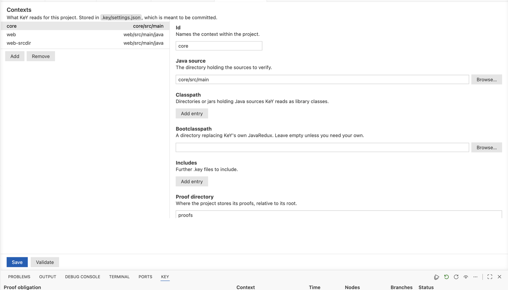
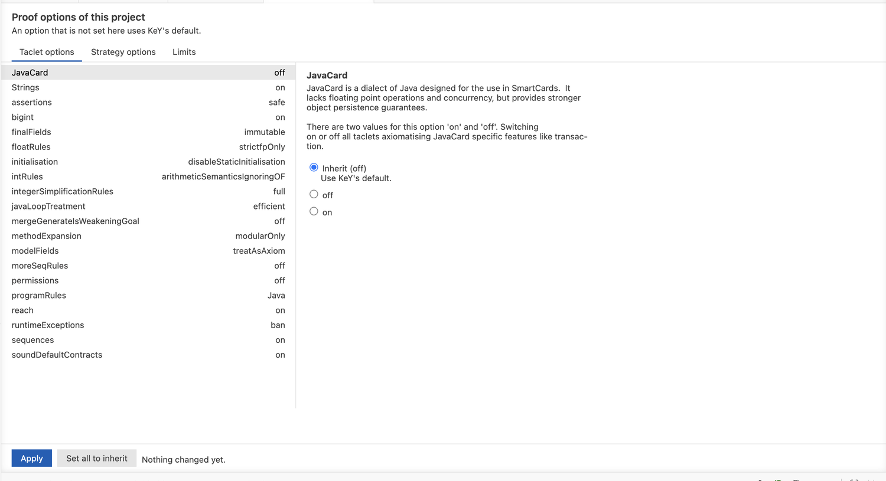
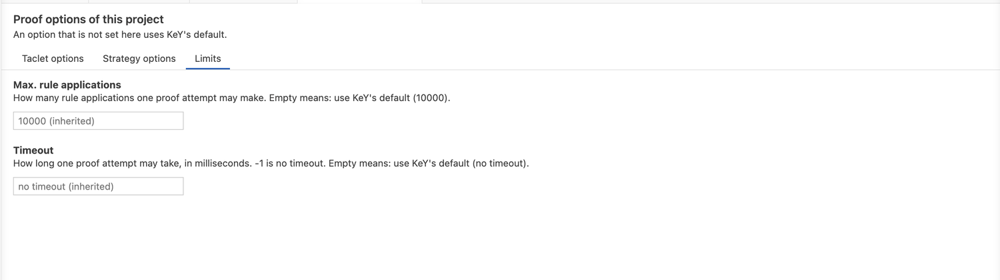

# Settings

Two places: the editor's settings, which belong to you, and `.key/settings.json`, which
belongs to the project and travels with it.

## The editor's settings

| Setting | What it decides |
|---|---|
| **key.keyJar** | the `key-*-exe.jar` the extension starts |
| **key.bridgeJar** | the `key-ide-common-*-all.jar` it starts alongside |
| **key.javaHome** | the JDK 21 both are run with. Empty uses `JAVA_HOME`, then `java` from the path |
| **key.keyHome** | where that KeY keeps its settings, logs and caches: **project** (`.key/tool`), which starts from KeY's own defaults and keeps one project out of another, or **user** (`~/.key`), shared with a KeY you start yourself |
| **key.verifyOnSave** | replay a context's proofs when its sources are saved, and prove what is left unproved. On by default |
| **key.trashPolicy** | what becomes of a proof that a rerun replaced: **never**, **emptyOnStart**, **belowSize**, **olderThan** |
| **key.trashMegabytes** | the size the trash is kept below, for `belowSize` |
| **key.trashDays** | the age at which a replaced proof is deleted, for `olderThan` |
| **key.transport** | how the extension reaches KeY. **auto** picks what works on the platform; **tcp** forces a loopback port |

Replaced proofs are kept in `proofs/.trash`, which is why the trash has a policy at all: a
rerun that turns out worse than what it replaced can be undone by hand. The policy is applied
when a window opens, since an editor is asked to shut down quickly.

!!! note
    `key.transport` rarely needs changing. On Windows the extension asks for a loopback port
    by itself, because Node reaches a local socket there only as a named pipe.

## The project's file

`.key/settings.json`, written through **KeY: Edit Contexts** or by hand, and meant to be
committed.

**KeY: Edit Contexts** opens a form: the contexts on the left, the selected one on the right.
A path can be typed or picked, and one inside the project is stored relative to it. Saving
checks what was entered and shows each problem on the field it belongs to.

A **context** is one set of paths KeY can load:

| Field | What it is |
|---|---|
| **id** | names the context within the project |
| **javaSource** | the directory holding the sources to verify |
| **classpath** | entries holding Java sources KeY reads as library classes |
| **bootclasspath** | a directory replacing KeY's own JavaRedux, when you need your own |
| **includes** | further `.key` files to include |

Paths are stored relative to the project when they lie inside it, so the file travels with
the project. The file also holds **proofDirectory**, where the project stores its proofs,
`proofs` by default.

## Proof options

The settings a proof is attempted with, at three levels: the project, a context, and a
single proof obligation. Each level states only what it changes, so a setting nobody states
is the one KeY uses by default.

The form has a tab for each kind:

- **Taclet options** — the choices KeY read from its rule files, for example how method
  calls are treated. These change *what* is proved.
- **Strategy options** — how the proof is searched, for example loop treatment or
  arithmetic. These change how long it takes, not what it means.
- **Limits** — **Max. rule applications**, how many rule applications one attempt may make,
  and **Timeout**, how long one attempt may take in milliseconds. KeY's `-1` means no
  timeout. A field left empty inherits.

The options of a tab are listed on the left with the value each one has, the ones this level
decides marked; the selected option is set on the right, with what it means and what it
accepts, so an option is read together with its explanation rather than as one row in a wall
of them. Every option offers **Inherit** as well as its values, and says what it would
inherit; **Set all to inherit** does it for the whole form.

Only the options you changed are sent, which is what makes editing several obligations at
once safe: each keeps what you did not touch. Where the selected obligations disagree about
an option, the form shows it as unset and leaving it alone keeps each as it is.

Run **KeY: Proof Options of the Project** for the project, or **KeY: Proof Options** on rows
in the Proof Obligations pane for a context or for single obligations. Every option is
offered with KeY's own name and explanation, so the wording matches KeY's own dialogs.

## The prover

One choice per project, in the status bar and on the KeY toolbar rather than in the
settings, because it is the kind of thing you change while working: **SC** for the
single-threaded prover, or **MT** with a number of workers for the parallel one. KeY decides between them from a setting that
belongs to the prover rather than to a proof, so it holds for every proof of the project.
